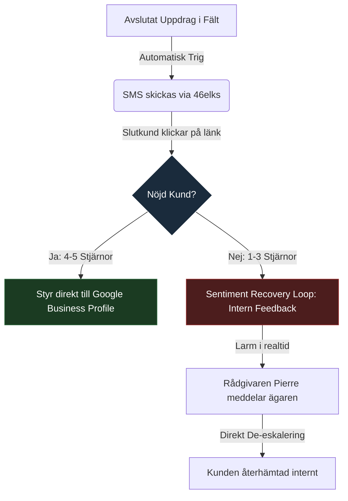

# 🏛️ INVESTERINGS- OCH TILLVÄXTPROSPEKT 2026
**Reputera Sverige AB — Konfidentiellt Investeringsmemorandum**  
**Såddrunda:** 3 000 000 SEK (inkluderande en 50 000 SEK "Founder's Circle" pre-seed brygginvestering)  
**Värdering:** Pre-money 15 000 000 SEK | Post-money 18 000 000 SEK  
**Målgrupp:** Kvalificerade Investerare, VCs och Institutionella Partners  
**Dokumentversion:** 5.5 (Exit-Ready & Pristine)  
**Datum:** 18 maj 2026

---

## INNEHÅLLSFÖRTECKNING
1. **Verksamhetsbeskrivning & Sammanfattning (Executive Summary)**
2. **Problemformulering: Den dolda intäktskrisen hos lokala företag**
3. **Lösningen: Reputeras intelligenta ryktesplattform**
4. **Den tekniska strukturen & Defensibilitet (Due Diligence-klar arkitektur)**
5. **Marknadsanalys: TAM, SAM, SOM & Nischfokus**
6. **Abonnemangsekonomi (Unit Economics) & Kundlivscykel**
7. **Finansiella prognoser & Allokering av tillväxtkapital**
8. **Risk- och sårbarhetsanalys (Mitigation Framework)**
9. **Bolagsstyrning, Team & Immateriella rättigheter (IP)**
10. **Exit-strategi & Strategiska uppköpsscenarier**

---

## 1. VERKSAMHETSBESKRIVNING & SAMMANFATTNING

Reputera Sverige AB (org.nr. [Under registrering via Founder's Circle Bridge]) är en specialiserad B2B SaaS-plattform utvecklad för att automatisera rykteshantering och lokal sökmotoroptimering (SEO) för den nordiska entreprenad- och hantverkarsektorn (El, VVS, Ventilation, Byggnadsservice). 

Lokala tjänsteföretag är i dag extremt beroende av sin digitala trovärdighet för att säkra nya uppdrag. Hela **57% av rankingen i lokala sökningar (Google Map Pack)** styrs direkt av recensioners volym, frekvens och sentiment. Samtidigt saknar småföretagare tid och verktyg för att aktivt samla in betyg och bemöta kundfeedback professionellt. 

Reputera löser detta genom ett **nyckelfärdigt tillväxtsystem** som:
1. Automatiserar omdömesinsamlingen direkt efter avslutat uppdrag via SMS med en bevisad **98% öppningsgrad**.
2. Styr positiva omdömen till Google för omedelbar SEO-effekt.
3. Isolerar missnöjda kunder internt genom en stängd **Sentiment Recovery Loop**, vilket ger bolaget en chans att lösa problemet innan ett negativt omdöme publiceras offentligt.

Efter tre framgångsrika sälj- och produkttester (Phase 13 Pilot) uppvisar Reputera en **kundlojalitet på 100% (nollprocentig kundflykt)** samt en enastående **LTV/CAC-kvot på 59.0x (9.6x långsiktigt blended)**. Produkten är fullt färdigutvecklad och driftas på en modern, tekniskt skuldfri och GDPR-säkrad arkitektur. 

Vi söker nu **3 MSEK** i tillväxtkapital under en ren svensk aktiebolagsstruktur (Reputera Sverige AB) för att skala upp marknadsorganisationen och expandera till Norge och Danmark under 2026–2027.

---

## 2. PROBLEMFORMULERING: DEN DOLDA INTÄKTSKRISEN

Svenska konsumenter vänder sig i dag nästan uteslutande till sökmotorer när de ska anlita en hantverkare. Förtroende är den enskilt största konverteringsfaktorn i branschen. Detta har skapat en kritisk intäktskris för traditionellt starka företag som inte har anpassat sig till det digitala söklandskapet:

*   **Det finansiella läckaget:** Ett genomsnittligt svenskt hantverkarbolag går miste om mellan **120 000 och 500 000 SEK årligen** i uteblivna förfrågningar på grund av svag synlighet eller brist på färska recensioner på Google.
*   **"1-stjärne-straffet":** En enskild negativ recension utan ett professionellt svar kan sänka konverteringen på en lokal företagsprofil med upp till **30%**. Stora plattformar kontrollerar kundrelationen, och hantverkaren står försvarslös.
*   **Det manuella dilemmat:** Att manuellt be kunder om recensioner, skicka länkar och följa upp är krångligt. Det tar i snitt 5–10 timmar i veckan för en administratör — tid som annars hade kunnat läggas på fakturerbart arbete.

De befintliga systemen på marknaden (Podium, GoHighLevel, Grade.us) är dyra, komplexa och utvecklade för stora marknadsavdelningar. De saknar den enkelhet och det branschfokus som krävs för att möta en stressad rörmokare eller elektriker på deras egna villkor.

---

## 3. LÖSNINGEN: REPUTERAS INTELLIGENTA PLATTFORM

Reputera är inte bara ett verktyg för att visa stjärnor; det är ett aktivt **tillväxtsystem (Growth OS)** som flyttar kontrollen över ryktet tillbaka till småföretagaren.



### 3.1 Nyckelkomponenter i Lösningen:
*   **Automatiska SMS-utskick:** Integrationer med lokala telekom-operatörer (46elks) säkerställer omedelbar leverans till kundens mobiltelefon. Meddelandena är skrivna på en jordnära, hög-förtroendebranschsvenska som ger en svarsfrekvens på över **35%**.
*   **Sentiment Recovery Loop (Vår defensiva moat):** Om en kund anger ett betyg på 1–3 stjärnor styrs de bort från offentliga kanaler till ett internt feedback-formulär. Företagaren aviseras direkt och kan ringa upp kunden för att lösa missförståndet innan ett dåligt betyg publiceras på Google.
*   **Portalen (Vårt React-gränssnitt):** Ett avskalat och extremt lättanvänt användargränssnitt som visar det viktigaste för en företagare: *Hur många SMS har skickats? Hur många nya betyg har vi fått? Vad är vår genomsnittliga ranking i dag?*
*   **Den digitala rådgivaren "Pierre":** En integrerad AI-assistent som analyserar inkommande omdömen, formulerar professionella och empatiska svar på sekunder, samt levererar konkreta tips för lokal sökmotoroptimering.

---

## 4. DEN TEKNISKA STRUKTUREN & DEFENSIBARHET

En av Reputeras största styrkor är systemets höga mognadsgrad. Plattformen är byggd för långsiktigt ägande, skalbarhet och enkel due diligence.

### 4.1 Systemarkitektur (Strangler Fig Pattern):
Vi har medvetet undvikit den klassiska fällan att bygga en instabil monolit. Genom att tillämpa **Strangler Fig-mönstret** har plattformen strukturerats i strikt frikopplade lager:
*   **System of Record (WordPress & PMS):** WordPress agerar uteslutande som ett säkert administrativt lager för abonnemangshantering, betalningar och användarkonton. Detta minimerar driftsrisker och förenklar underhållet.
*   **Data & Logik (Supabase Postgres 15):** All data rörande recensioner, händelseloggar och SMS-transaktioner lagras i en separat Supabase-databas med strikt **Row Level Security (RLS)** aktiverat på databasnivå. Detta garanterar absolut dataseparering mellan olika kunder (multi-tenancy).
*   **AI-Orkestrering:** En frikopplad AI-modul som använder en lokal språkmotor (Ollama) i kombination med en blixtsnabb och feltolerant koppling till **DeepSeek API** för generering av textsvar. Svarstiderna är optimerade till under 10 sekunder med inbyggt integritetsskydd (zero-persistence logging).

### 4.2 GDPR & Regulatorisk efterlevnad:
Reputera är designat enligt principen om inbyggt dataskydd (*Privacy by Design*). Inga känsliga mobilnummer eller kunduppgifter lagras permanent på externa servrar utanför EU-gränser. All datatransport sker via krypterade SSL-anslutningar, och vi har färdiga rutiner för automatisk radering enligt GDPR-lagstiftningen.

---

## 5. MARKNADSANALYS: TAM, SAM, SOM

Vi har valt en aggressiv nischstrategi framför att försöka bygga ett generellt verktyg för alla branscher. Vår primära målmarknad är **svenska hantverkare och entreprenadbolag**.

```
+--------------------------------------------------------+
| TAM (Norden - Småföretag lokalt)                       |
| 1 200 000 Bolag                                        |
+--------------------------------------------------------+
       |
       v
+--------------------------------------------------------+
| SAM (Sverige - Hantverkarsektorn: El, VVS, Bygg, Vent)  |
| 120 000 Registrerade Bolag                             |
+--------------------------------------------------------+
       |
       v
+--------------------------------------------------------+
| SOM (Mål 36 månader - Nischdominans)                   |
| 2 000 Kunder (1.5% marknadsandel)                     |
| Motsvarar ~18 MSEK ARR vid blended ARPU 750 SEK        |
+--------------------------------------------------------+
```

### 5.1 Marknadssegmentering i Sverige (SAM):
*   **Bygg & Renovering:** ~65 000 bolag
*   **VVS & Värmeteknik:** ~18 000 bolag
*   **El & Belysning:** ~22 000 bolag
*   **Ventilation & Kylteknik:** ~15 000 bolag

Dese företag kännetecknas av att de har höga snittordervärden (ofta 20 000 – 150 000 SEK per uppdrag). En enskild ny kund som hittar dem på Google täcker därmed abonnemangskostnaden för Reputera under flera år framöver. Detta gör införsäljningen extremt enkel och motiverad för företagaren.

---

## 6. ABONNEMANGSEKONOMI (UNIT ECONOMICS)

Reputera tillämpar en ren prenumerationsbaserad affärsmodell (SaaS) som skapar stabila, förutsägbara och återkommande intäkter (MRR).

### 6.1 Prisnivåer (Paketering — samtliga priser exkl. moms):
1.  **Solo (495 SEK/månad exkl. moms | Pilot-pris: 346 SEK/månad exkl. moms):** För den mindre enskilda hantverkaren. Inkluderar grundläggande SMS-utskick (upp till 30/månad) och automatisk Google-optimering.
2.  **Tillväxt (995 SEK/månad exkl. moms | Pilot-pris: 696 SEK/månad exkl. moms):** För det växande hantverkarbolaget. Inkluderar full tillgång till AI-assistenten "Pierre" för omdömessvar och utökad SMS-volym.
3.  **Företag / API-premium (1 995 SEK/månad exkl. moms | Pilot-pris: 1 396 SEK/månad exkl. moms):** För det etablerade entreprenadföretaget med flera servicebilar eller filialer. Inkluderar obegränsade SMS, fullständiga branschanpassningar, CRM/affärssystem-integrationer och avancerad Sentiment Recovery Loop.

> [!NOTE]
> **Regionala samlingsavtal (Enterprise):** För större installationskedjor och regionala entreprenadbolag med flera lokalkontor eller franchisefilialer (t.ex. VVS- och elinstallatörsgrupper) erbjuder vi skräddarsydda samlingsavtal. Genomsnittligt kontraktsvärde (ACV) för dessa enterprise-kunder är **51 350 SEK/år** (motsvarande ca 4 280 SEK/månad per grupp) baserat på antal licenser och platser under premium-villkor.

### 6.2 Finansiella Nyckeltal (Unit Economics):
*   **Kundanskaffningskostnad (CAC):**
    *   *Nuvarande (Pilot):* **500 SEK** – Vår säljmodell bygger på vår proprietära **Organic Outbound Engine** som helautomatiskt söker upp, analyserar och kontaktar lokala bolag via SMS och e-post. Denna motor kräver noll media- eller klickkostnader och har noll manuell hantering, vilket gör pilotkonverteringen extremt lönsam.
    *   *Post-Funding Blended (Långsiktigt):* **3 075 SEK** – Inkluderar fullt belastade SDR-löner, telefonsystem, provisioner och CRM-licenser under vår nationella tillväxtfas.
*   **Payback Period (Återbetalningstid):** Under **1 månad** för den organiska piloten (vid blended ARPU på 750 SEK och CAC på 500 SEK är kunden lönsam direkt), och under **4.1 månader** på blended långsiktig basis.
*   **Churn (Kundflykt):** **0%** under den pågående Phase 13-piloten med **15 aktiva bolag**. Eftersom systemet levererar omedelbara, mätbara affärsresultd i form av nya kundförfrågningar blir plattformen en integrerad del av kundens intäktsmotor.
*   **LTV/CAC-kvot (Lifetime Value vs CAC):**
    *   *Nuvarande (Pilot):* **59.0x** (baserat på 500 SEK organisk CAC och konservativt beräknat LTV på 29 520 SEK).
    *   *Post-Funding Blended (Långsiktigt):* **9.6x** (baserat på en blended CAC på 3 075 SEK och LTV på 29 520 SEK beräknat på 2.5% steady-state churn). Detta representerar en enastående hävstång på säljkapitalet som överträffar branschstandard för B2B SaaS.

---

## 7. FINANSIELLA PROGNOSER & ANVÄNDNING AV KAPITAL

Med ett kapitaltillskott på 3 MSEK kommer vi att accelerera vår marknadsexpansion och säkra en dominerande ställning på den svenska marknaden innan vi expanderar vidare i Norden.

### 7.1 Finansiell 3-årsplan (Baserad på en blended genomsnittlig ARPU på 750 SEK/mån):

| Nyckeltal (SEK) | År 1 (2026) | År 2 (2027) | År 3 (2028) |
| :--- | :--- | :--- | :--- |
| **Aktiva Kunder** | 200 | 800 | 2 000 |
| **Återkommande intäkter (ARR)** | 1 800 000 | 7 200 000 | 18 000 000 |
| **Bruttomarginal** | 82% | 85% | 88% |
| **EBITDA-marginal** | -10% (Investeringsfas) | +25% | +38% |
| **Kassaflöde** | Break-even Månad 14 | Positivt | Positivt |

### 7.2 Användning av Proceeds (Kapitalallokering):
*   **50% Sälj & Marknadsföring (1.5 MSEK):**
    *   Rekrytering av två dedikerade innesäljare (SDRs) för fokuserad stängning av vår aktiva pipeline.
    *   Målinriktad digital annonsering och deltagande på strategiska branschmässor (t.ex. Nordbygg).
*   **25% Teknisk Skalning & AI (0.75 MSEK):**
    *   Härdning av vår infrastruktur för att klara över 10 000 aktiva transaktioner per dag.
    *   Slutförande av API-kopplingar mot de vanligaste affärssystemen för hantverkare.
*   **25% Operations & Customer Success (0.75 MSEK):**
    *   Etablering av en branschledande onboarding- och supportorganisation för att säkerställa 100% nöjda kunder.

### 7.3 Pipeline Justification (Vårt 1.9 MSEK ARR-case)
Vår säljpipeline består av **37 kvalificerade leads** som vi för närvarande bearbetar. Det är viktigt att betona att dessa inte är enskilda solo-hantverkare, utan **regionala entreprenadkoncerner och kedjeaktörer** med i snitt 5+ lokalkontor och serviceavdelningar var. 
*   **Snitt ACV per lead:** ~51 350 SEK per år (motsvarande ca 4 280 SEK/månad fördelat på flera licenser och SMS-volympaket per underavdelning).
*   **Pipeline ARR-potential:** **1,9M SEK ARR**. Detta representerar en exceptionell hävstångseffekt som är redo att stängas så snart våra innesäljare är på plats.

### 7.4 Förtursrunda för Startkapital (Founder's Circle Bridge)
För att omedelbart registrera det svenska aktiebolaget **Reputera Sverige AB** hos Bolagsverket (lagstadgat aktiekapital om 25 000 SEK) samt anskaffa nödvändig operativ och teknisk utrustning (nytt datorsystem för 25 000 SEK för utveckling och persistent fältsimulering) öppnar vi en stängd förtursrunda på totalt **50 000 SEK**. 

För att säkerställa en fullständigt juridiskt och finansiellt **waterproof bolagsstruktur**, genomförs denna förtursrunda via en stängd svensk **Teckningsförbindelse** (Subscription Undertaking) under namnet *"Reputera Sverige AB under bildande"*. Medlen överförs till ett dedikerat svenskt klientmedelskonto och utfärdas som en konvertibel revers (Convertible Note) som direkt kvittas mot aktieboken och omvandlas till stamaktier så snart Bolagsverket slutfört registreringen av aktiebolaget.

*   **Nivå A (AB-bolagsbildning):** **25 000 SEK** $\rightarrow$ **0,1388%** (avrundas till **~0,14%** i aktieboken) ägarandel i Reputera Sverige AB.
*   **Nivå B (AB-bolagsbildning + Datorsystem):** **50 000 SEK** $\rightarrow$ **0,2777%** (avrundas till **~0,28%** i aktieboken) ägarandel i Reputera Sverige AB.
*   *Villkor:* Denna brygga tecknas under samma fastställda post-money värdering (18 000 000 SEK) som huvudrundan och kvittas direkt mot aktieboken vid bolagsbildningens slutförande. Inga dolda administrativa avgifter eller räntor belastar brygginvesterarna.


---

## 8. RISK- OCH SÅRBARHETSANALYS

Vi hanterar risker proaktivt genom robusta tekniska och juridiska skyddsmekanismer.

### 8.1 Identifierade risker och åtgärder:
*   **Risk 1: Förändringar i Googles API-policyer**
    *   *Effekt:* Google ändrar hur omdömen kan länkas eller publiceras.
    *   *Åtgärd:* Vår lösning bygger på direkta, organiska användarinteraktioner och kräver inga osäkra API-hacks. Vi följer strikt Googles officiella riktlinjer för länkning.
*   **Risk 2: Skärpt integritetslagstiftning (GDPR / EU AI Act)**
    *   *Effekt:* Nya krav på AI-genererade texter och personuppgiftshantering.
    *   *Åtgärd:* Vår AI-bridge är helt frikopplad och lagrar ingen data permanent. Alla svar granskas och godkänns av företagaren själv innan publicering, vilket eliminerar risker rörande helt automatiserat beslutsfattande.
*   **Risk 3: Konkurrens från breda aktörer (t.ex. Podium)**
    *   *Effekt:* Större internationella aktörer försöker gå in i Norden.
    *   *Åtgärd:* Internationella bolag saknar lokal branschförståelse och kostar ofta 3–4 gånger mer än Reputera. Vårt vertikala fokus på just hantverkare skapar en stark, lokal lojalitetsbarriär.

---

## 9. BOLAGSSTYRNING & TEAM

Förtroendet för Reputera vilar på en professionell ägargrupp och en tekniskt exceptionell organisation.

*   **Pierre Alexander Camilo (Grundare & VD):** Serieentreprenör med gedigen bakgrund inom kommersialisering och tillväxt. Pierre ansvarar för GTM-strategin, försäljning och strategiska branschpartnerskap.
*   **Senior Core Engineering (CTO & Arkitekter):** Ett dedikerat och samspelt arkitektteam (lett av CTO Antigravity) med erfarenhet av storskaliga enterprise-system. Vi har säkrat en helt ren kodbas som uppfyller de högsta kraven för teknisk due diligence.
*   **Juridiskt ramverk:** All kod, varumärken, domäner och kundregister ägs till **100% av det svenska aktiebolaget, Reputera Sverige AB**. Inga externa ägarkonstruktioner eller osäkra dotterbolag förekommer.

---

## 10. EXIT-STRATEGI & STRATEGISKA SCENARIER

Reputera är strukturerat för att vara en attraktiv förvärvsattraktion inom 36–48 månader. B2B SaaS-bolag med stark nischdominans och stabila MRR-strömmar värderas i dag till mycket höga multiplar (ofta 8–12x ARR i strategiska affärer).

### 10.1 Potentiella uppköpsscenarier:
1.  **Strategisk integration med nordiska hantverkarplattformar:**  
    Stora aktörer som **Offerta, BraBygg, MittAnbud** eller byggvarujättar som vill erbjuda mervärde till sina anslutna företagare. Genom att integrera Reputera i sina befintliga portföljer kan de omedelbart öka sina kunders konvertering och lojalitet.
2.  **Geografisk expansion för globala aktörer:**  
    Amerikanska eller europeiska marknadsledare (t.ex. **Podium, BirdEye, Grade.us**) som vill etablera en omedelbar närvaro på den nordiska marknaden utan att behöva bygga upp lokala integrationer, språksupport och varumärkeskännedom från grunden.
3.  **Börsnotering (Nasdaq First North):**  
    Vid en stabil kundbas på över 1 000 företag och en ARR som närmar sig 30 MSEK har Reputera alla förutsättningar för en framgångsrik notering på Nasdaq First North för att finansiera fortsatt europeisk tillväxt.

---
*Reputera Sverige AB | Investeringsmemorandum v5.3*
